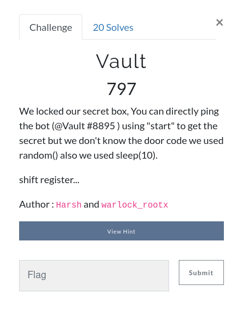
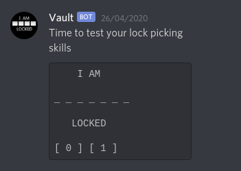
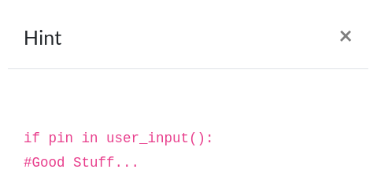
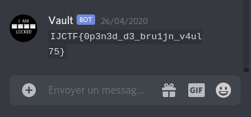

# Vault



when we dm the bot on discord with "start" it asks for a 7 digit pin composed of 1 and 0.



the pin is random and it keeps changing so we can't brutforce it, let's check the hint.



the bot simply checks if the right pin is in the input message, so we can just generate a long<br>
message randomly with the provided digits and send it, the discord message length is 2000 chars<br>
so it's long enough to guess the pin, there are 6 levels with different digits<br>
here is a small script that generates the messages.<br>


```python
#!/usr/bin/python2
import random


num_list = []
num_list.append(['0', '1'])
num_list.append(['4', '5', '6'])
num_list.append(['5', '6', '7', '8', '9'])
num_list.append(['1', '2', '3', '4'])
num_list.append(['0', '1', '2', '5', '8', '9'])
num_list.append(['0', '1'])


for l in num_list:
    code = ''
    for i in range(2000):
            code += random.choice(l)
    print code
```
# Flag

