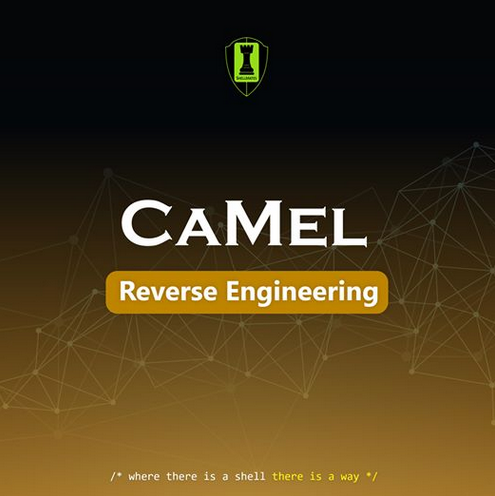

# Camel

### Description
```
category: Reverse Engineering ⚙️ 

This weird program is different than any other one I've reverse-engineered so far, it looks simple in the way it works
it prompts for some credentials, but I couldn't even find the main function, can you retrieve the correct credentials?
```
Attachment: .<br>



```
$ file camel
camel: ELF 64-bit LSB pie executable, x86-64, version 1 (SYSV), dynamically linked, interpreter /lib64/ld-linux-x86-64.so.2,
BuildID[sha1]=5d9fa9246e251d93b99c2c347bb5f3302c394a79, for GNU/Linux 3.2.0, with debug_info, not stripped
```
when we execute the binary it prints some ascii art and waits for a name
```
$ ./camel

                                                        =--_
                                         .-""""""-.     |* _)
                                        /          \   /  /
                                       /            \_/  /
           _                          /|                /
       _-'"/\                        / |    ____    _.-"            _
    _-'   (  '-_            _       (   \  |\  /\  ||           .-'".".
_.-'       '.   `'-._   .-'"/'.      "   | |/ /  | |/        _-"   (   '-_
             '.      _-"   (   '-_       \ | /   \ |     _.-'       )     "-._
           _.'   _.-'       )     "-._    ||\\   |\\  '"'        .-'
         '               .-'          `'  || \\  ||))
jjs__  _  ___  _ ____________ _____  ___ _|\ _|\_|\\/ _______________  ___   _
                       c  c  " c C ""C  " ""  "" ""
                   c       C
              C        C
                   C
    C     c
Who are you?
shell
You are not allowed to use this program
```
when looking at the disassembly with radare2 we find a lot of function calls that seem to be related to ocaml<br>
after tracing the calls a bit we find the camlRide_the_camel__take_a_ride_219() function and we find the name "Xavier"<br>
```assembler
┌ 168: sym.camlRide_the_camel__take_a_ride_219 ();
│       ╎    sub rsp, 8
│       ╎    mov rax, 1
│       ╎    call sym.camlRide_the_camel__print_banner_80
│       ╎    lea rax, loc.camlRide_the_camel__19 ; 0x59190 ; "Who are you?"
│       ╎    call sym.camlStdlib__print_endline_321
│       ╎    mov rax, 1
│       ╎    call sym.camlStdlib__read_line_339
│       ╎    lea rsi, loc.camlRide_the_camel__20 ; 0x591a8 ; "Xavier"
│       ╎    mov rdi, rax
│       ╎    call sym.caml_string_equal
│       ╎    cmp rax, 1
│      ┌──<  jne 0x20215
│      │╎    lea rax, loc.camlRide_the_camel__21 ; 0x591b8 ; "You are not allowed to use this program"
│      │╎    call sym.camlStdlib__print_endline_321
│      │╎    mov rax, 3
│      │╎    call sym.camlStdlib__exit_399
│      └──>  lea rax, loc.camlRide_the_camel__22 ; 0x591e8 ; "Welcome, enter the secret number"
│       ╎    call sym.camlStdlib__print_endline_321
│       ╎    mov rax, 1
│       ╎    call sym.camlStdlib__read_int_341
│       ╎    cmp rax, 0x2c17c65f
│      ┌──<  je 0x20258
│      │╎    mov qword [rsp], rax
│      │╎    call sym.camlRide_the_camel__check_139
│      │╎    cmp rax, 1
│     ┌───<  je 0x20258
│     ││╎    lea rax, loc.camlRide_the_camel__89 ; 0x59848
│     ││╎    mov rbx, qword [rsp]
│     ││╎    add rsp, 8
│     ││└─<  jmp sym.camlRide_the_camel__decrypt_145
│     └└──>  lea rax, loc.camlRide_the_camel__90 ; 0x59860 ; "Wrong secret number"
│            add rsp, 8
└            jmp sym.camlStdlib__print_endline_321
```
after that it asks for a secret number and if it is equal to 0x2c17c65f it prints "wrong secret number" otherwise it calls<br>
camlRide_the_camel__check_139() and if it return a number different then one it calls camlRide_the_camel__decrypt_145()
which decrypts and prints the flag<br>
```assembler
┌ 39: sym.camlRide_the_camel__check_139 ();
│       ┌─>  cmp rax, 0x2c17c65f
│      ┌──<  je 0x20050
│      │╎    cmp rax, 0x2c17c65f
│     ┌───<  jle 0x20048
│     ││╎    mov rax, 1
│     ││╎    ret
│     └───>  lea rax, [rax + rax + 1]
│      │└─<  jmp sym.camlRide_the_camel__check_139
│      └──>  mov rax, 3
└            ret
```
by looking at the 7th line "lea rax, [rax + rax + 1]" it seems that the secret number is 0x2c17c65f/2 which is 369877807<br>
but that doesn't work because one bit of each int in OCaml is used for garbage collection, ints are on 31 bits not 32 bits<br>
so the actual number it check for is 369877807/2 which is 184938903<br>
### Solution
```
$ ./camel

                                                        =--_
                                         .-""""""-.     |* _)
                                        /          \   /  /
                                       /            \_/  /
           _                          /|                /
       _-'"/\                        / |    ____    _.-"            _
    _-'   (  '-_            _       (   \  |\  /\  ||           .-'".".
_.-'       '.   `'-._   .-'"/'.      "   | |/ /  | |/        _-"   (   '-_
             '.      _-"   (   '-_       \ | /   \ |     _.-'       )     "-._
           _.'   _.-'       )     "-._    ||\\   |\\  '"'        .-'
         '               .-'          `'  || \\  ||))
jjs__  _  ___  _ ____________ _____  ___ _|\ _|\_|\\/ _______________  ___   _
                       c  c  " c C ""C  " ""  "" ""
                   c       C
              C        C
                   C
    C     c
Who are you?
Xavier
Welcome, enter the secret number
184938903
23117363
Congratulations!!! The flag is : shellmates{wh0_kn0ws_ab0ut_0Caml?}
```
