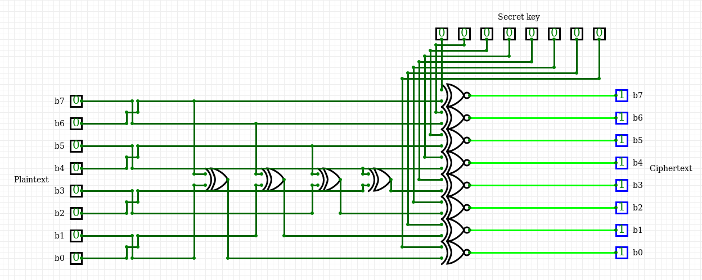

# Circuit

### Description
```
Hello soldier,
It seems like ROXy and FOXy found another way to encrypt data, they are now using hardware based encryption
for the sake of encrypting huge amount of data. Our secret agent has successfully sniffed out the most important
file in our mission to crack their secret, the blueprint of their logic circuit! He additionnaly captured 
an encrypted message that we are curious to know its contents.
Now it's all up to you to reverse engineer the circuit, and provide us with a decryption of their messages.

Yours sincerely, TheMentor.
```
Attachments: .<br>




The circuit encrypts the text one character at the time using only one character as the encryption key<br>
All we have to do is reverse the circuit and brut-force the encryption key<br>
```python
#!/usr/bin/env python2

with open('secret.enc') as f:
    ct = f.read()
    f.close()


for key in range(255):
    pt = ''
    for c in ct:
        i = ord(c)

        b  = 0
        b += 0 if ((i & 32 )^(key & 32 )) else 16
        b += 0 if ((i & 16 )^(key & 16 )) else 32
        b += 0 if ((i & 128)^(key & 128)) else 64
        b += 0 if ((i & 64 )^(key & 64 )) else 128

        b += 1 if (((i & 2)^(key & 2)) and b & 128) or (not ((i & 2)^(key & 2)) and not b & 128) else 0
        b += 2 if (((i & 1)^(key & 1)) and b & 64 ) or (not ((i & 1)^(key & 1)) and not b & 64 ) else 0
        b += 4 if (((i & 8)^(key & 8)) and b & 32 ) or (not ((i & 8)^(key & 8)) and not b & 32 ) else 0
        b += 8 if (((i & 4)^(key & 4)) and b & 16 ) or (not ((i & 4)^(key & 4)) and not b & 16 ) else 0
 
        pt += chr(b)

    if 'shellmates' in pt:
        print 'secret key : ' + str(key)
        print 'message : \n' + pt
```
# Flag
shellmates{h@rD\/\/4r3_b@sEd_enCrYpT10N_1$_suP3r_f4$t!!}
