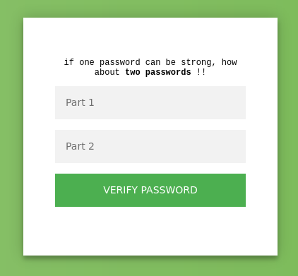
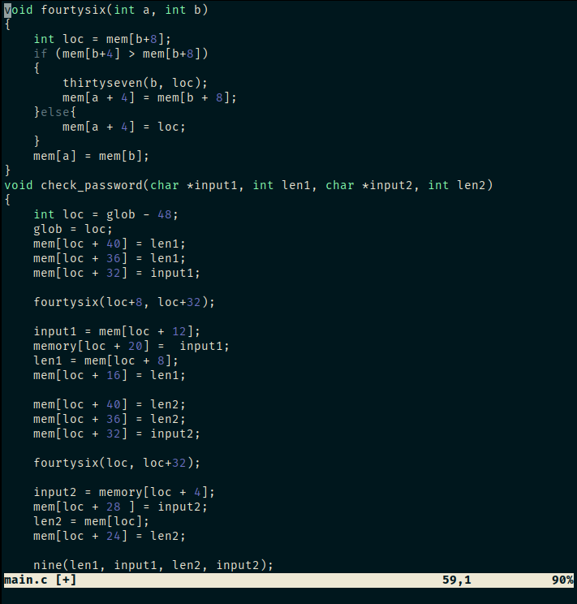
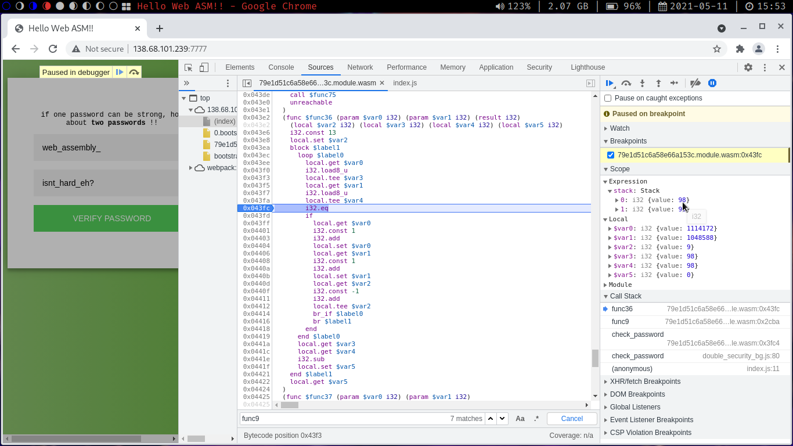

# Hello WASM
——————— 𝘼𝙪𝙩𝙝𝙤𝙧 𝙣𝙤𝙩𝙚 ———————<br>
𝗖𝗵𝗮𝗹𝗹𝗲𝗻𝗴𝗲’𝘀 𝗻𝗮𝗺𝗲: Hello WASM.<br>
𝗖𝗮𝘁𝗲𝗴𝗼𝗿𝘆: Reverse.<br>
𝗗𝗲𝘀𝗰𝗿𝗶𝗽𝘁𝗶𝗼𝗻: Some say that client-side validation<br>
isn't secure at all because everything is visible<br>
to the end-user. Funny right! I'm surely gonna<br>
refute this saying with my new double password<br>
verification using this *high level* technology..<br>
or low level? whatever. I hope no one proves me wrong<br>
or I’m gonna have to start all over again…<br>
Link to the challenge : http://138.68.101.239:7777/<br>
——————————————————————— <br>
<br>
In the network traffic, I can see a request for 79e1d51c6a58e66a153c.module.wasm, so I downloaded it<br>
and tried dumping the strings in the binary:
```bash
$ strings 79e1d51c6a58e66a153c.module.wasm
...
wiesbn_ta_shssrc/lib.rs
aermdb_leyh_?
...
```
I noticed two interesting strings, but they weren't the correct passwords, it may be checking the passwords<br>
against these two strings using some special algorithm, so I decompiled it to C source using [wabt](https://github.com/WebAssembly/wabt) and found<br>
check_password() function, but the source code was very hard to understand, so I decided to translate the binary<br>
to text format and reverse it to C source by hand. After reversing check_password() and the first function that it<br>
calls, I found out it did nothing! It only performs a variable swap that will be undone by check_password() right after<br>
<br>
So I asked the author and he told me that a lot of code is generated by the wasm compiler and that I should try another<br>
approach. After some searching I found a [wasm debugging chrome extension](goo.gle/wasm-debugging-extension) and started setting breakpoints at the end<br>
of check_password(), if the execution didn't reach it make another one before it and so on to find all the checks performed,<br>
and it worked!. It checks if both passwords are 13 characters long then it compares password1 then password2 char-by-char<br>
against those strings from before, So we can set only one breakpoint at this check, and leak the flag one char at the time<br>
<br>

# Flag
```
shellmates{web_assembly_isnt_hard_eh?}
```

